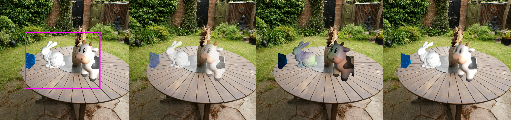

# AR-in-VR Simulator

The AR-in-VR Simulator is a Unity plugin for simulating various aspects and artefacts of augmented reality devices and presenting them in real-time within a virtual reality headset for rapid user testing and perceptual research.

More details about the architecture and uses of the toolbox can be found within our [paper](https://dl.acm.org/doi/10.1145/3675231.3675240)

If you use or build on this work please consider citing the toolbox:

<section class="section" id="BibTeX">
  

    <h2 class="title">BibTeX</h2>
    <pre><code>@inproceedings{hadnett2024ar,
        title={AR-in-VR simulator: A toolbox for rapid augmented reality simulation and user research},
        author={Hadnett-Hunter, Jacob and Lundell, Benjamin and Ellison-Taylor, Ian and Porubanova, Michaela and Alasaarela, Tapani and Olkkonen, Maria},
        booktitle={ACM Symposium on Applied Perception 2024},
        pages={1--11},
        year={2024}
}</code></pre>
  

</section>

## Current state of the toolbox

Please note that as of September 2024 the code here is a minimalist implementation of the AR-in-VR Simulator. The full version will be released shortly. 

The current version includes an example Unity project making use of fhernand's 'Bedroom' scene [(link)](https://sketchfab.com/3d-models/bedroom-869e6ec859a84240b9a099ae829f47fa).

Gaussian Splatting can be used to render the backgound envrionments instead by importing the [UnityGaussianSplatting](https://github.com/aras-p/UnityGaussianSplatting/tree/main) project by Aras Pranckevičius.

## Using the toolbox

Stay tuned for documentation.

